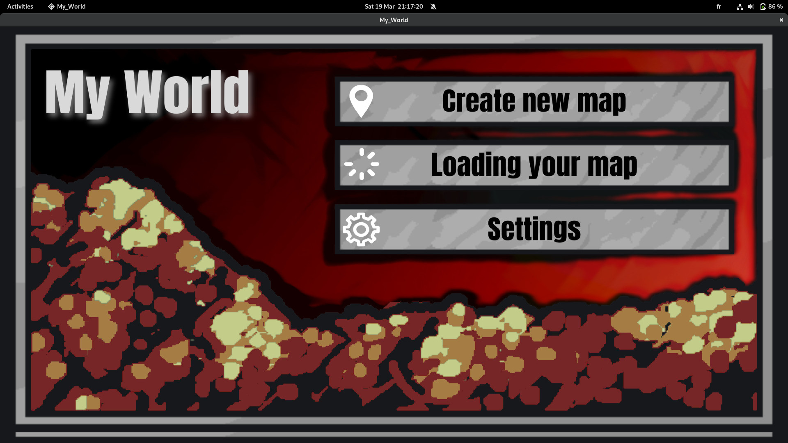
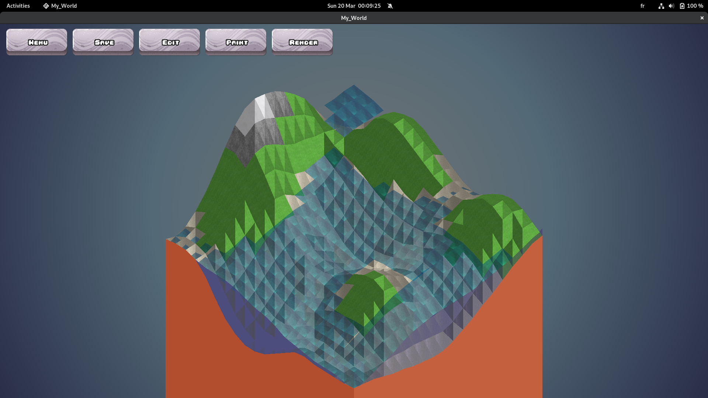
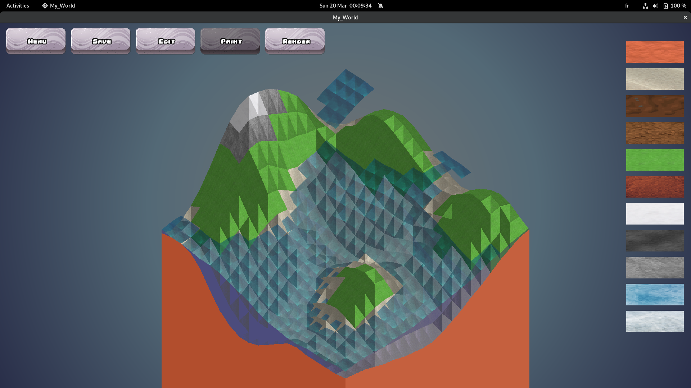

# My_World

A C map generator with various options such as the paint mode,
a manual or random based generation
on perlin noise, being able to display various things such as textures,
isometric lines, a radius around each vertex...

# Features

## Menu

    - Create new map : Left click for create new map and open the editor window.
    - Loading yout map : Left click for load yout map and open the editor window.
    - Settings : : Left click to go to settings.

## Settings

    - Sound (on click a button) : Left click to enable or disable.
    - Music : Left click to enable or disable.
    - Back to menu : Left click for return into menu.

## Editor

If the button is grey, the mode is enable.

    - Menu : Left click to return into menu.
    - Save : Left click to save your map.
    - Edit : Left click to display and enable or disable the edit mode and edits button.
    - Paint : Left click to display and enable or disable the paint mode and texture for paint them.
    - Render : Left click to display and enable or disable the render mode and render button.

### Edit
    - Radius map : Right click to increase the square corners variable.
                   Left click to decrease the square corners variable.
    - Reset map : Right click to reset your map.
    - Random gen : Right click to automaticaly create map.
    - Help : Right click to open the window help with all commands available.
    - Force edit : Right click to increase the strenght edition variable.
                   Left click to decrease the strenght edition variable.

### Render

If the button is green, the mode is enable.

    - Display line : Left click to display isometric grid.
    - Display point : Left click to display corners of squares.
    - Display texture : Left click to display textures. 
    - Display cube : Left click to display the map on a cube
    - Display light : Left click to display lights.

### Paint

You will see textures on the right of your screen, by left clicking you will
select it and if you click on the map the texture will replace the other which
is already present.

## KEYBOARD

    ESCAPE = CLOSE \
    L = SMOOTH \
    R = RANDOM MAP BRUIT PERLIN \
    S = SAVE MAP \
    J = INCREASE RADIUS DE CLICK \
    K = DECREASE RADIUS DE CLICK \
    "+" = ZOOM IN \
    "-" = ZOOM OUT \
    UP ARROW : ASCEND MAP \
    DOWN ARROW : DESCEND MAP \
    RIGHT ARROW : MOVE MAP RIGHT \
    LEFT ARROW : MOVE MAP LEFT \
    E : DECREASE HEIGHT Y \
    A : INCREASE HEIGHT Y \
## Screenshots

### Menu

### Settings

### Editor

### Editor Edit

### Editor Render

### Editor Texture

## Used By

This project was achived by :

- https://github.com/JasonLAGOUTE
- https://github.com/RoheeAxel

